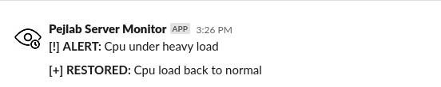

# loadmonitor


[](https://github.com/wickdchromosome/loadmonitor/issues)

[](https://opensource.org/licenses/MIT)

<div align="center"></div>

## Description


Keep an eye your Linux box using Slack - you will get notified with a(n):

- Warning if Ram usage exceeded 75%
- Alert if Ram usage exceeded 85%
- Alert if CPU loadavg/num_cpus > 1 (loadavg also takes into account swap usage, etc)


## Dependencies

- gcc
- curl

## Installation
To install the app, first create a new Slack app, and enable incoming webhooks for your target channel.
Then run:
```
sudo bash setup.sh
```

This will compile the project and add it as a systemd service. You will also get a prompt to test
your webhook with a "Hello World!" message.

## Usage
To take the app for a spin, start the service by doing:
```
sudo systemctl start slack_monitor
```

Test whether the app is working as expected:
```
sudo systemctl status slack_monitor
```

If things are working fine, you can enable the service so that it starts up on every startup:
```
sudo systemctl enable slack_monitor
```
